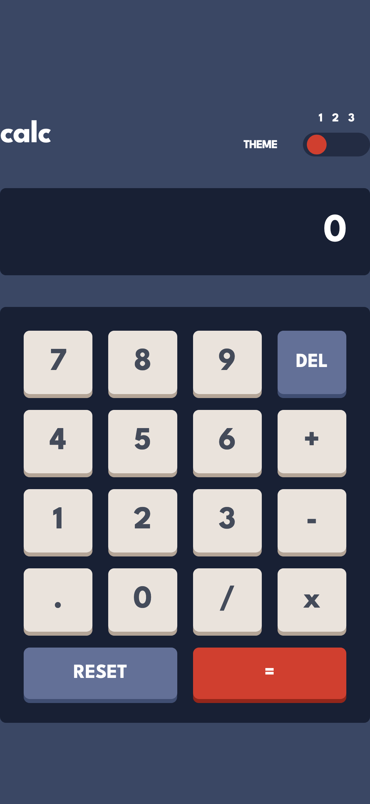

# Frontend Mentor - Calculator app solution

This is a solution to the [Calculator app challenge on Frontend Mentor](https://www.frontendmentor.io/challenges/calculator-app-9lteq5N29).

## Table of contents

- [Overview](#overview)
  - [The challenge](#the-challenge)
  - [Screenshot](#screenshot)
  - [Links](#links)
- [My process](#my-process)
  - [Built with](#built-with)
  - [What I learned](#what-i-learned)
  - [Continued development](#continued-development)
  - [Useful resources](#useful-resources)
- [Author](#author)
- [Acknowledgments](#acknowledgments)

## Overview

### The challenge

Users should be able to:

- See the size of the elements adjust based on their device's screen size
- Perform mathmatical operations like addition, subtraction, multiplication, and division
- Adjust the color theme based on their preference
- **Bonus**: Have their initial theme preference checked using `prefers-color-scheme` and have any additional changes saved in the browser

### Screenshot




### Links

- Solution URL: [Click here](https://github.com/Antonio0402/react-calculator-app.git)
- Live Site URL: [Click here](https://your-live-site-url.com)

## My process

### Built with

- Semantic HTML5 markup
- CSS custom properties
- Flexbox
- CSS Grid
- Mobile-first workflow
- [Tailwindcss](https://tailwindcss.com) - Tailwindcss
- [React](https://reactjs.org/) - JS library

### What I learned

- Building a webb app from scratch using React JS and styling seperated components with all CSS using utilities classes first approach;
- Using Reacts hooks to manage state and logical for computing values in webb app

- Using custom CSS properties to create the multiple themes and also reacts hooks to switch between theme

```css
@layer base {
  /* Theme-color */
  :root {
    --main-fill: 224deg 36% 15%;
    --keypad-fill: 223deg 31% 20%;
    --toggle-fill: var(--keypad-fill);
    --screen-fill: 222deg 26% 31%;

    --keys-fn: 225deg 21% 49%;
    --keys-fn-shadow: 224deg 28% 35%;
    --keys-equal: 6deg 63% 50%;
    --toggle: var(--keys-equal);
    --keys-equal-shadow: 6deg 70% 34%;
    --keys-number: 30deg 25% 89%;
    --keys-number-shadow: 28deg 16% 65%;

    --text-base: 0deg 0% 100%;
    --text-keys-fn: var(--text-base);
    --text-keys-number: 221deg 14% 31%;

    --fs-700: 2.5rem; /* 40px tracking-[-0.015em] */
    --fs-600: 2rem; /* 40px  leading-none */
    --fs-500: 2rem; /* 32px tracking-[-0.015em] */
    --fs-400: 1.25rem; /* 20px */
    --fs-300: 0.75rem; /* 12px leading-none tracking-[0.08em] */

    /* Tracking */
    --tracking-wider-80: 0.08em;
    --tracking-tighter-15: -0.015em;
  }

  .theme-2 {
    --main-fill: 0deg 0% 90%;
    --keypad-fill: 0deg 5% 81%;
    --toggle-fill: var(--keypad-fill);
    --screen-fill: 0deg 0% 93%;

    --keys-fn: 185deg 42% 37%;
    --keys-fn-shadow: 185deg 58% 25%;
    --keys-equal: 25deg 98% 40%;
    --toggle: var(--keys-equal);
    --keys-equal-shadow: 25deg 99% 27%;
    --keys-number: 45deg 7% 89%;
    --keys-number-shadow: 35deg 11% 61%;

    --text-base: 60deg 10% 19%;
    --text-keys-fn: 0deg 0% 100%;
    --text-keys-number: var(--text-base);
  }

  .theme-3 {
    --main-fill: 268deg 75% 9%;
    --keypad-fill: 268deg 71% 12%;
    --toggle-fill: var(--main-fill);
    --screen-fill: var(--keypad-fill);

    --keys-fn: 281deg 89% 26%;
    --keys-fn-shadow: 285deg 91% 52%;
    --keys-equal: 176deg 100% 44%;
    --toggle: var(--keys-equal);
    --keys-equal-shadow: 177deg 92% 70%;
    --keys-number: 268deg 47% 21%;
    --keys-number-shadow: 290deg 70% 36%;

    --text-base: 52deg 100% 62%;
    --text-keys-fn: 0deg 0% 100%;
    --text-keys-number: var(--text-base);
    --text-keys-equal: 198deg 20% 13%;
  }

  /* Font size */
  @screen sm {
    :root {
      --fs-700: 3.5rem; /* 56px leading-none */
      --fs-600: 2.5rem;
      --fs-400: 1.75rem; /* 28px leading-none */
    }
  }
}
```

If you want more help with writing markdown, we'd recommend checking out [The Markdown Guide](https://www.markdownguide.org/) to learn more.

**Note: Delete this note and the content within this section and replace with your own learnings.**

### Continued development

- I am going to keep trying to have a good grasp of using Tailwindcss class in advanced projects.
- Fully comprehend the React library 's functions by building dynamic data fetching components in the future projects.

### Useful resources

- [Tailwind CSS - Scrimba](https://www.youtube.com/watch?v=4wGmylafgM4)
- [Beginer Project Tutorial - Web Dev Simplified](https://www.youtube.com/watch?v=DgRrrOt0Vr8&t=267s)

## Author

- Frontend Mentor - [@Antonio0402](https://www.frontendmentor.io/profile/Antonio0402)

## Acknowledgments

So much thanks specially to Web Dev Simplified Youtube Chanel for helping me get through this project as provide the tutorial for the main logical computation behind the UI (*with a little modified from me*) on this projects.
